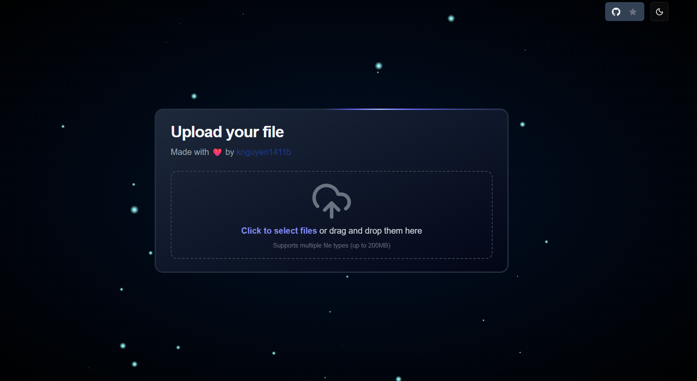
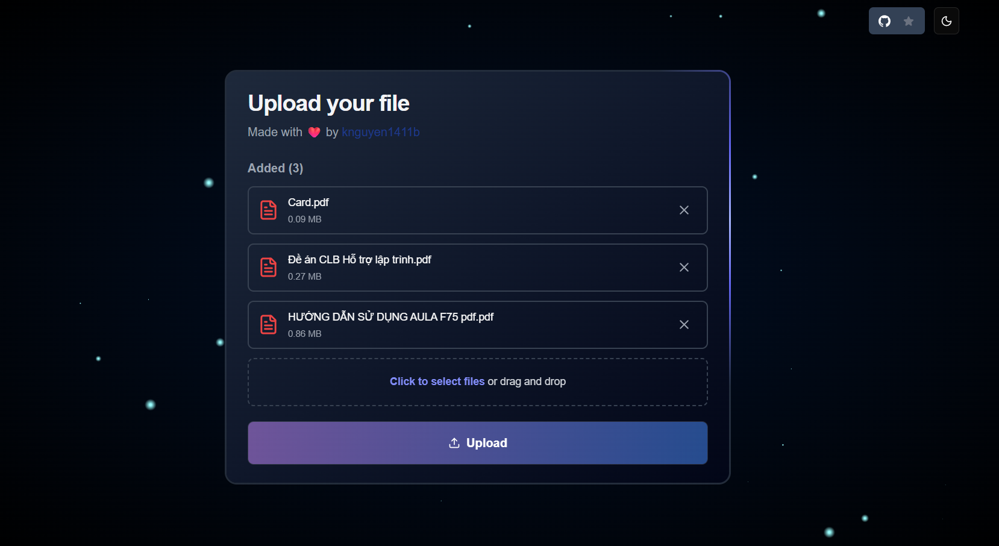
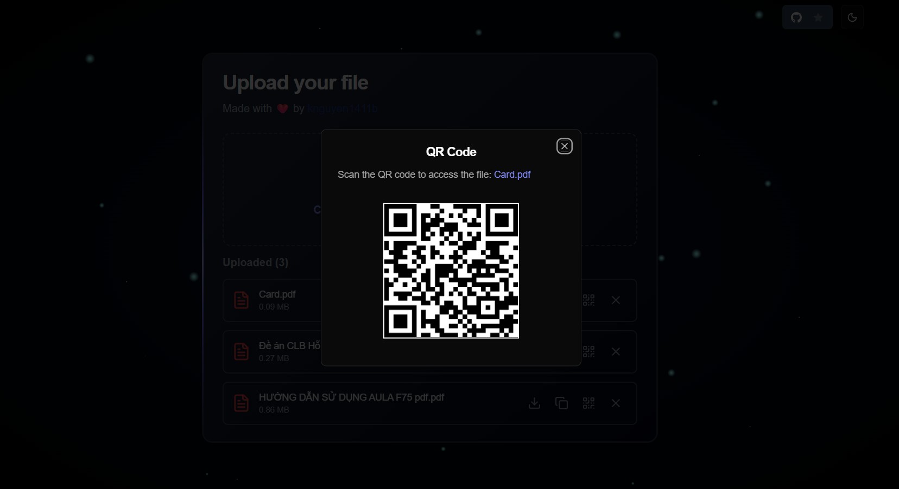

# 📂 File Uploader

A modern file uploader built with **Next.js 14**, **TypeScript**, and **TailwindCSS**.  
Supports drag & drop, multiple file uploads, preview, persistent storage, and QR code sharing.

---

## 🚀 Live Demo

👉 [Try it here](https://file-uploader.vercel.app)

---

## ✨ Features

- 🚀 Upload multiple files at once
- 📥 Drag & drop support
- 📱 Generate QR codes for quick sharing
- 💾 Local storage persistence (keep uploaded history after reload)
- 🎨 Clean & modern UI with TailwindCSS + shadcn/ui
- 🔔 Toast notifications with [sonner](https://sonner.emilkowal.ski/)
- ⚡️ Catbox API proxy for file hosting

---

## 🛠️ Tech Stack

- [Next.js 14 (App Router)](https://nextjs.org/)
- [TypeScript](https://www.typescriptlang.org/)
- [TailwindCSS](https://tailwindcss.com/)
- [Shadcn/ui](https://ui.shadcn.com/)
- [Lucide Icons](https://lucide.dev/)
- [Sonner](https://sonner.emilkowal.ski/) for toasts
- [Catbox](https://catbox.moe/) for file hosting

---

## 📸 Screenshots

Upload Area

Upload Files

QR Code Share

👉 You can even scan the QR code directly from the demo to download uploaded files.

---

## 📜 License

MIT License © 2025 - [Khanh Nguyen](https://github.com/knguyen1411b)
