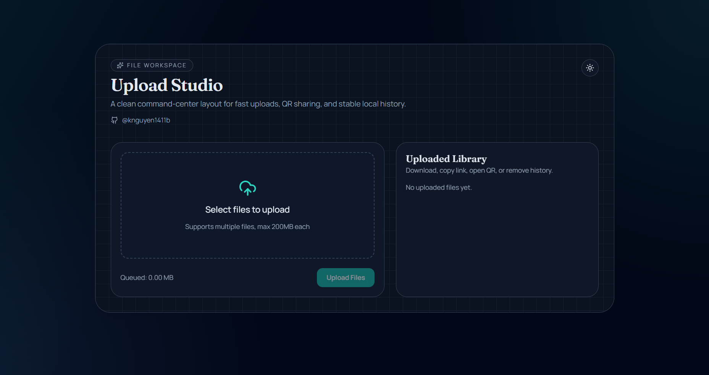
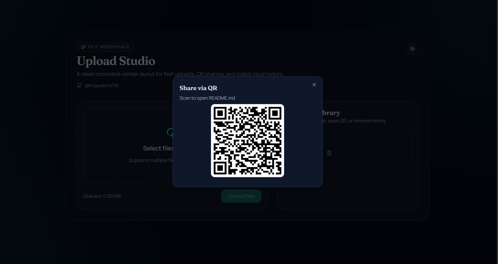

# File Uploader

A modern, design-forward file uploader built with Next.js 16, React 19, and Tailwind CSS v4, featuring instant QR sharing, smooth dark/light theming, and a polished mobile-first experience.




## Features

- Upload multiple files with duplicate-name filtering
- Download, copy link, delete item, and QR share
- Dark/light theme with responsive mobile-first UI
- Local upload history persistence (`localStorage`)
- Internal upload API (`/api/upload`, `/api/upload/[id]`)

## Tech Stack

- Next.js 16 (App Router)
- React 19
- Tailwind CSS v4
- TypeScript
- Vitest

## Project Structure

```txt
app/
  api/upload/route.ts
  api/upload/[id]/route.ts
  image.png
  image-1.png
  layout.tsx
  page.tsx
features/
  uploader/
    components/uploader-app.tsx
    hooks/use-file-uploader.ts
    types.ts
lib/
  upload-store.ts
```

## Getting Started

```bash
pnpm install
pnpm dev
```

Default app URL: `http://localhost:3002`

## Scripts

```bash
pnpm dev
pnpm lint
pnpm test
pnpm build
pnpm start
```

> [!NOTE]
> Current upload storage uses in-memory `Map` (`lib/upload-store.ts`). Uploaded files are cleared after server restart.
